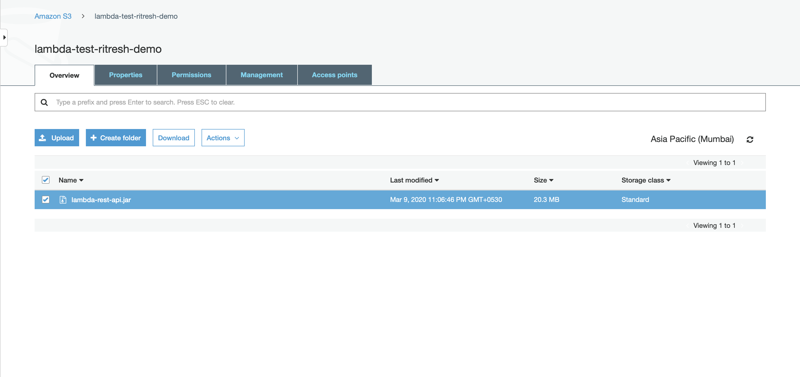
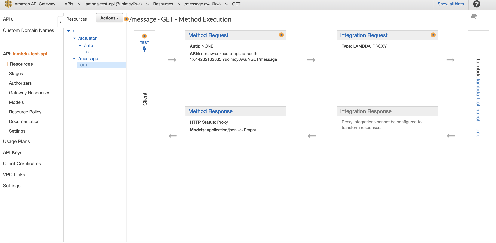
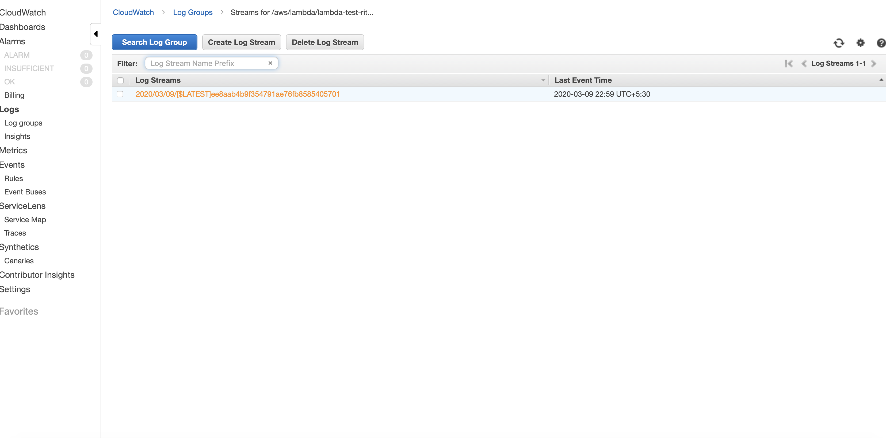
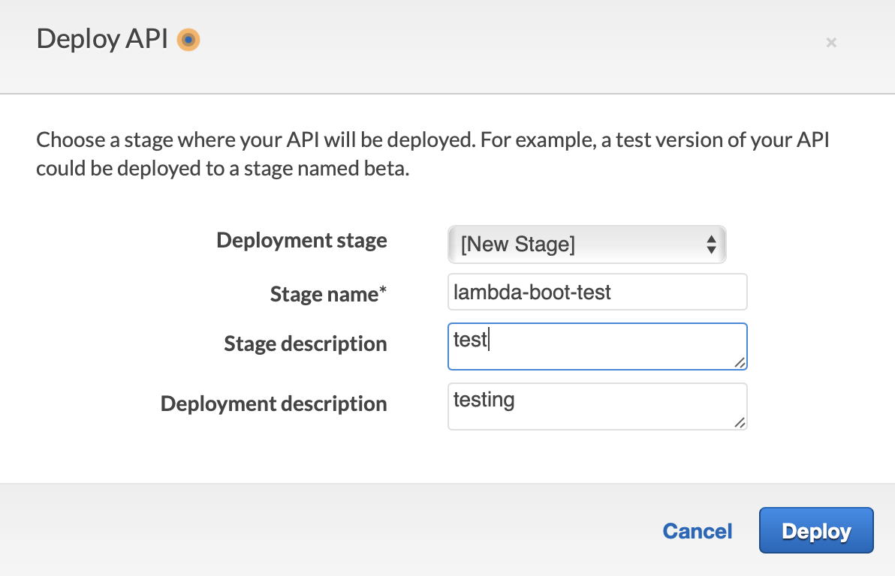
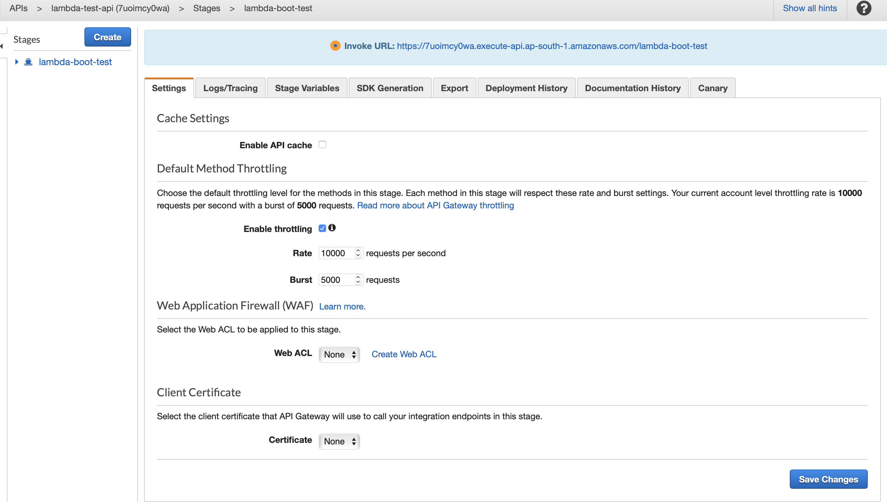

# Aws Java lambda Function - Spring Boot2 Rest Api Demo Application

### Pre-requisite
* Basic knowledge of AWS/S3/Api/Gateway/Spring boot/Git
* Follow below steps to set Up Api and Lambda function.

In this demo application , i am sharing the basic knowledge to set up Api and configure Lambda function. There are easy way to do that by using aws-cli's , will show in another example.
 
### Follow Steps to build , deploy and test are :

* Checkout Repo code
```
git clone https://github.com/RitreshGirdhar/lambda-spring-boot2-rest-api.git
cd lambda-spring-boot2-rest-api
```

* Build code on local
```
mvn clean package shade:shade
```

* Create Bucket in S3 i am creating bucket with name lambda-test-ritresh-demo and uploading target/lambda-rest-api.jar there.
```
aws s3 cp target/lambda-rest-api.jar s3://lambda-test-ritresh-demo/
```


* Let's Create Message resource api using AWS Api Gateway.
 
  
* While testing you could monitor or debug requests logs under cloudwatch.
  
  

* Let's Deploy Function and get the production url
 
 
 
* Let's test lambda function on production by invoking the prod url 
````
curl -ivk https://7uoimcy0wa.execute-api.ap-south-1.amazonaws.com/lambda-boot-test/message
*   Trying 13.127.88.87...
* TCP_NODELAY set
* Connected to 7uoimcy0wa.execute-api.ap-south-1.amazonaws.com (13.127.88.87) port 443 (#0)
* ALPN, offering h2
* ALPN, offering http/1.1
* Cipher selection: ALL:!EXPORT:!EXPORT40:!EXPORT56:!aNULL:!LOW:!RC4:@STRENGTH
* successfully set certificate verify locations:
*   CAfile: /etc/ssl/cert.pem
  CApath: none
* TLSv1.2 (OUT), TLS handshake, Client hello (1):
* TLSv1.2 (IN), TLS handshake, Server hello (2):
* TLSv1.2 (IN), TLS handshake, Certificate (11):
* TLSv1.2 (IN), TLS handshake, Server key exchange (12):
* TLSv1.2 (IN), TLS handshake, Server finished (14):
* TLSv1.2 (OUT), TLS handshake, Client key exchange (16):
* TLSv1.2 (OUT), TLS change cipher, Client hello (1):
* TLSv1.2 (OUT), TLS handshake, Finished (20):
* TLSv1.2 (IN), TLS change cipher, Client hello (1):
* TLSv1.2 (IN), TLS handshake, Finished (20):
* SSL connection using TLSv1.2 / ECDHE-RSA-AES128-GCM-SHA256
* ALPN, server accepted to use h2
* Server certificate:
*  subject: CN=*.execute-api.ap-south-1.amazonaws.com
*  start date: Sep 27 00:00:00 2019 GMT
*  expire date: Oct 27 12:00:00 2020 GMT
*  issuer: C=US; O=Amazon; OU=Server CA 1B; CN=Amazon
*  SSL certificate verify ok.
* Using HTTP2, server supports multi-use
* Connection state changed (HTTP/2 confirmed)
* Copying HTTP/2 data in stream buffer to connection buffer after upgrade: len=0
* Using Stream ID: 1 (easy handle 0x7faf8e803c00)
> GET /lambda-boot-test/message HTTP/2
> Host: 7uoimcy0wa.execute-api.ap-south-1.amazonaws.com
> User-Agent: curl/7.54.0
> Accept: */*
> 
* Connection state changed (MAX_CONCURRENT_STREAMS updated)!
< HTTP/2 200 
HTTP/2 200 
< date: Mon, 09 Mar 2020 17:53:59 GMT
date: Mon, 09 Mar 2020 17:53:59 GMT
< content-type: application/json
content-type: application/json
< content-length: 23
content-length: 23
< x-amzn-requestid: fa1900a8-9455-4701-9702-db073413d9a3
x-amzn-requestid: fa1900a8-9455-4701-9702-db073413d9a3
< x-amz-apigw-id: JIlbcHKbhcwFRXA=
x-amz-apigw-id: JIlbcHKbhcwFRXA=
< x-amzn-trace-id: Root=1-5e6682af-27618a800c64b7a841c94694;Sampled=0
x-amzn-trace-id: Root=1-5e6682af-27618a800c64b7a841c94694;Sampled=0

< 
* Connection #0 to host 7uoimcy0wa.execute-api.ap-south-1.amazonaws.com left intact
{"text":"Hello World!"}
````